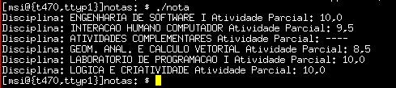

[](LICENSE)

# Unaerp

Programa para obter as notas do boletim de um determinado aluno.



## Requisitos

- json-c - [https://github.com/json-c/json-c](https://github.com/json-c/json-c)
- libcurl - [http://curl.haxx.se/libcurl/c](http://curl.haxx.se/libcurl/c)

## Build

```
$ make unaerp
```

## Run

```
$ ./unaerp <ra number> <password>
$ ./unaerp 123456 123456
Disciplina: ENGENHARIA DE SOFTWARE I Atividade Parcial: 10,0
Disciplina: INTERACAO HUMANO COMPUTADOR Atividade Parcial: 8,5
,,,
```

## Clean

```
$ make clean
```
